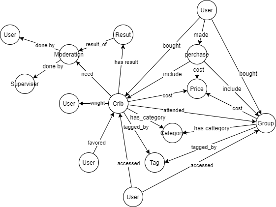

# ADR.03 Выбор системы хранения для обеспечения доступа

## Контекст и проблематика
В системе будет хранится множество высокосвязанных и малоструктурированных данных. Система хранения должна эффективно работать с такими данными.
У проектируемой системы высрокий потенциал к развитию функциональности. Система хранения не должна быть легко модифицируемой и надстраиваемой.

## Решение
Используем графовое хранилище данных для хранения доступа и мета информации.

## Плюсы
- Позволяет эффективно решить бизнес задачи управления доступом, каталогизацией и тегированием контента;
- Легко расширяется, система хранения не будет сильно влиять на новый функционал;
- Структура данных будет легко восприниматься;
- При развитии системы даннвые будет легко анализировать.

## Риски
Требуется специалисты, которые умеют работать с графовыми БД. Риск смягчается тем, что в МТС работают компетентные специалисты. 

### Набросок структуры данных

