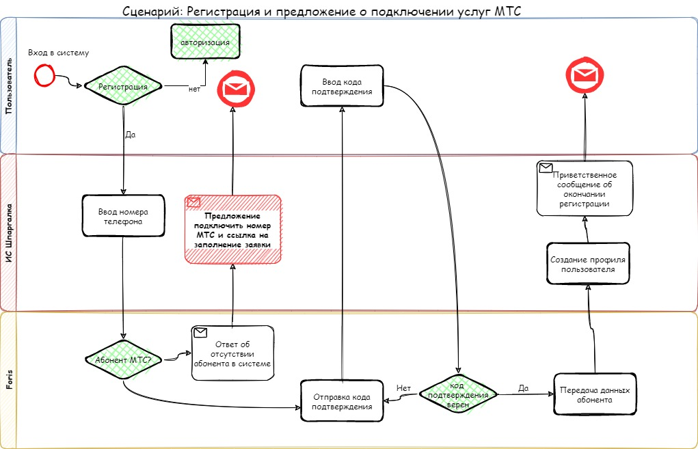
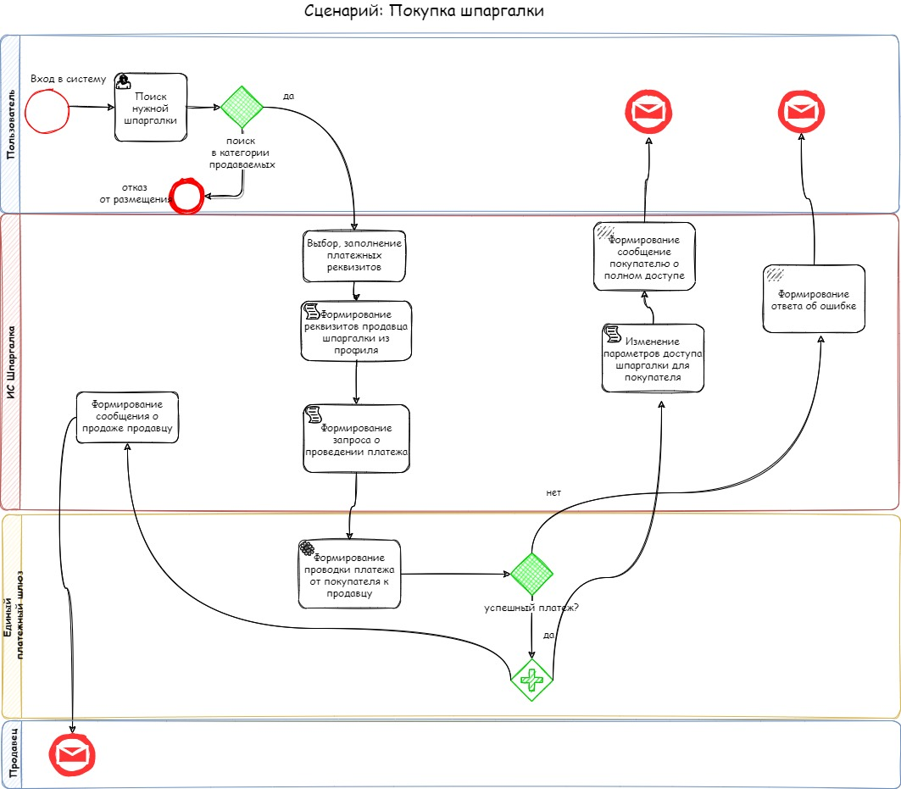

# MTS Kata "Шпаргалки" от команды Танго

- [Наша команда](https://gitlab.services.mts.ru/avendour/archkata#команда-танго)
- [Вводные](https://gitlab.services.mts.ru/avendour/archkata#вводные)
- [Бизнес цели](https://gitlab.services.mts.ru/avendour/archkata#бизнес-цели)
- [Бизнес требования](https://gitlab.services.mts.ru/avendour/archkata#бизнес-требования) 
- [Стейкхолдеры](https://gitlab.services.mts.ru/avendour/archkata#стейкхолдеры)
- [Сценарии](https://gitlab.services.mts.ru/avendour/archkata#сценарии)
- [Требования к системе](https://gitlab.services.mts.ru/avendour/archkata#требования-к-системе)
    - [Функциональные](https://gitlab.services.mts.ru/avendour/archkata)
    - [Атрибуты качества](https://gitlab.services.mts.ru/avendour/archkata#атрибуты-качества)
- [Architecture Decision Records](https://gitlab.services.mts.ru/avendour/archkata#architecture-decision-records)
- [Архитектура](https://gitlab.services.mts.ru/avendour/archkata#архитектура)
    -   [Контекст системы](https://gitlab.services.mts.ru/avendour/archkata#контекст-системы)
    -   [Контейнерная диаграмма](https://gitlab.services.mts.ru/avendour/archkata#контейнерная-диаграмма)
    -   [Компонентная диаграмма](https://gitlab.services.mts.ru/avendour/archkata#компонентная-диаграмма)

## Команда "Танго"

***Члены команды:***
**Александр, Павел, Максим, Татьяна**

**Кто мы:**  мы коллеги разных команд, но одной компании, что нас и объединяет. Мы разные, мы разработчики, архитекторы, аналитики, но при этом мы делаем одно дело и любим его одинаково и идем в одном направлении, развиваемся и стремимся стать профессиональнее и опытнее. Мы работаем над множеством проектов и продуктов, которые нужны людям, каждый вносит свой вклад в общий успех нашей компании. Мы видим цель и идем к ней!
А еще мы просто хорошие, веселые, энергичные и умные люди! 

## Вводные
*Необходимо разработать сервис:*
1)	Сервис бесплатный, но должен быть доступен только абонентам МТС.
2)	Позволяющий отображать в приложении на мобильном телефоне шпаргалки в форматах pdf, txt, epub, которые пользователь может загрузить через приложение.
3)	Нужно проработать функционал работы сотрудников или привилегированных юзеров (Рабочее место модератора), которые будут загружать / категоризировать контент, а также функционал для интеграции с мобильным приложением и бэкендом.
4)	После накопления базы шпаргалок появилась потребность в построении системы хранения контента для размещения файлов и быстрого доступа к ним.  Для нас важно, чтобы контент предоставлялся только тем пользователям, которым выданы права на конкретный файл или группу файлов, а также чтобы данные, передаваемые по сети, были максимально защищены.
5)	Мы ожидаем большой рост популярности сервиса в связи с тем, что подготовка к экзаменам с репетиторами - это довольно дорогостоящий процесс, который могут позволить себе не более 10% населения. Ожидаемая нагрузка - 500 rps с пиками в 800 rps в периоды экзаменов.
6)	Нужен функционал по продаже «шпаргалок» одними пользователями другим пользователям с использованием единого платежного шлюза МТС Банка.

## Бизнес цели
1)  Развивать список предоставляемых услуг в эко системе МТС.
2)  Задействовать интерес потребителей в обучении, необходимости иметь под рукой шпаргалку по нужной теме.
3)  Повышать узнаваемость бренда
4)  Расширение базы абонентов за счет привлечения дополнительных клиентов из-за бесплатного сервиса для заинтересованных клиентов в данном сервисе, но являющихся абонентами других операторов.

## Бизнес требования
| #     | Описание                                                                                                                           |
|-------|------------------------------------------------------------------------------------------------------------------------------------|
| BR.01 | Нужен сервис, который позволит сохранять шпаргалки в виде коротких текстов и картинок.                                             |
| BR.02 | Давать возможность быстро загружать свои данные в различных форматах, который будет сразу же после проверки доступен               |
| BR.03 | Сервис должен ограничивать доступ к контенту. Пользователь может просматривать шпаргалки только получив права на конкретные данные |
| BR.04 | Сервис должен позволять воспользоваться чужими данными купив их у другого пользователя                                             |
| BR.05 | Сервис должен давать возможность удобного поиска нужной информации                                                                 |
| BR.06 | Сервис должен обеспечивать работу модераторов                                                                                      |

## Стейкхолдеры
|Категория| 	Заинтересованное лицо                 | 	Потребности                                                                                                                                                                    |
|---------|----------------------------------------|---------------------------------------------------------------------------------------------------------------------------------------------------------------------------------|
|Заказчик| 	Департамент Шпаргалки                 | 	Система запущена и работает. Реализованы все фичи в срок согласно требованиям. Организована инфраструктура для достижения бизнес-целей и непрерывного функционирования Системы |
|Заказчик| 	Группа компаний МТС                   | 	Соответствие высоким стандартам оказания услуг Группы компаний МТС. Соответствие внутренним организационным и технологическим регламентам и стандартам Группы компаний МТС     |
|Спонсор| 	Бюджетодержатель                      | 	Система в срок достигает целевых показателей KPI                                                                                                                               |
|Специалист в предметной области| 	Автор шпаргалки                       | 	Возможность поделиться знаниями, развить личный бренд и заработать                                                                                                             |
|Регулярный пользователь| 	Читатель шпаргалки                    | 	Удобство сервиса и возможность найти релевантную шпаргалку. Бесперебойная доступность сервиса                                                                                  |
|Регулярный пользователь| 	Модератор                   | 	Возможность сделать жизнь других участников сообщества шпаргалок лучше - ограничить их доступ к некачественному контенту                                                       |
|Случайный пользователь| 	Читатель шпаргалки                    | 	Перестать искать в различных источниках необходимую информацию и найти сервис, где в одном месте есть все необходимые и релевантные шпаргалки                                  |
|Специалист в области реализации| 	Команда разработки                    | 	Быть причастными к разработке востребованного продукта и работать в компании - технологическом лидере                                                                          |
|Операционная поддержка| 	Администратор системы                 | 	Удобный интерфейс для выполняния функций: заведение пользователей, контроль прав, настройка справочников                                                                       |
|Операционная поддержка| 	Команда сопровождения                 | 	Минимальный поток обращений, понятность в обслуживании и наличие эксплуатационной документации                                                                                 |
|Руководитель проекта| 	Руководитель проекта                  | 	Реализуемость согласованных требований всех заинтересованных сторон к Системе и к процессу реализации                                                                          |
|Регулятор| 	Государственные органы                | 	Уверенность в том, что не публикуется запрещенный контент и персональные данные обрабатываются с учетом закона                                                                 |
|Внутренний регулятор| 	Комплаенс                             | 	Отсутствие ситуаций нарушения внутренних норм комплаенса                                                                                                                       |
|Внутренний регулятор| 	Информационная безопасность           | 	Соответствие Системы всем требованиям ИБ компании                                                                                                                              |
|Тестировщик| 	Контроль качества                     | 	Низкая плотность дефектов, качественная документация, сроки достаточные для проведения тестирования и хорошая структура кода                                                   |
|Поставщик| 	Владелец единого платежного шлюза МТС | 	Большой суммарный объем комиссии за транзакции и высокие профессиональные компетенции от команды разработки при интеграции                                                     |
|Поставщик| 	Владелец МТС медиа (Реклама, медиа)   | 	Дешевые и точные данные о пользователях Системы для повышения конверсии по своей воронке                                                                                       |

## Сценарии

## Требования к системе

### Функциональные требования

| #     | Cистема должна позволять                                                               | Функциональный блок                |
|-------|----------------------------------------------------------------------------------------|------------------------------------|
| FR.01 | пользователям регистрироваться и авторизовываться в системе                            | Управление ролями и пользователями |
| FR.02 | проверять является ли пользователь абонентом МТС                                       | Управление ролями и пользователями |
| FR.03 | администраторам заводить супервизоров                                                  | Управление ролями и пользователями |
| FR.04 | администраторам назначать модераторов                                                  | Управление ролями и пользователями |
| FR.05 | авторам загружать шпаргалки в систему                                                  | Управление контентом               |
| FR.06 | авторам настраивать уровни видимости для шпаргалок                                     | Управление контентом               |
| FR.07 | авторам группировать и тегировать шпаргалки                                            | Управление контентом               |
| FR.08 | авторам разрешать выбранным читателям просмотривать шпаргалки или группы шпаргалок     | Управление контентом               |
| FR.09 | авторам удалять шпаргалки                                                              | Управление контентом               |
| FR.10 | читателям просматривать шпаргалки                                                      | Управление контентом               |
| FR.11 | читателям сохранять шпаргалки для просмотра в оффлайн режиме                           | Управление контентом               |
| FR.12 | читателям оставлять жалобу на шпаргалку                                                | Управление контентом               |
| FR.13 | модераторам и супервизорам разрешать или запрещать публикацию шпаргалки                | Управление контентом               |
| FR.14 | отбирать шпаргалки для просмотра супервизором по преднастроенному алгоритму            | Управление контентом               |
| FR.15 | модераторам просматривать шпаргалки, не прошедшие модерацию                            | Управление контентом               |
| FR.16 | авторам назначать цену за доступ к шпаргалке/группе шпаргалок                          | Продажа контента                   |
| FR.17 | читателям покупать доступ к шпаргалке/группе шпаргалок через единый платежный шлюз МТС | Продажа контента                   |
| FR.18 | читателям просматривать шпаргалки,к которым был куплен доступ                          | Продажа контента                   |
| FR.19 | администраторам настраивать справочники мета данных                                    | Администрирование                  |
| FR.20 | не абонентам МТС перенести свой номер оператору МТС                                    | Продажа контента                   |
| FR.21 | авторам получать вознаграждение за купленные шпаргалки                                 | Продажа контента                   |
  
### Атрибуты качества
| #     | Атрибут качества      | Обоснование                                                                                                                                                                     |
|-------|-----------------------|---------------------------------------------------------------------------------------------------------------------------------------------------------------------------------|
| AR.01 | 	Масштабируемость     | 	Со временем объём хранимых в системе данных будет увеличиваться. Будет расти количество пользовательских данных и количество хранимых шпаргалок.                               |
| AR.02 | 	Эластичность         | 	В разные периоды времени количество пользователей, работающих с системой будет увеличиваться. Например, в периоды экзаменов нагрузка на систему увеличится более чем на 50%.   |
| AR.03 | 	Безопасность         | 	Основная идея бизнеса в платном предоставлении доступа к авторскому контенту. Поэтому данный атрибут качества является одним из приоритетных.                                  |
| AR.04 | 	Совместимость        | 	Система должна быть совместима с другими продуктами МТС: системой авторизации и платежным шлюзом.                                                                              |
| AR.05 | 	Устойчивость к сбоям | 	С системой взаимодействуют множество групп пользователей, преследующих свои цели. Проблема с одним из функциональных блоков не должны блокировать работу других пользователей. |

## Architecture Decision Records

| #      | Описание                                                                                                                                                                                                              |
|--------|-----------------------------------------------------------------------------------------------------------------------------------------------------------------------------------------------------------------------|
| ADR.01 | В проекте будем использовать практику ведения Architecture Decision Records                                                                                                                                           |
| ADR.02 | В качестве архитектурного стиля будет использоваться микросервисная архитектура. Подробнее в [ADR.02 Выбор архитектурного стиля](../ADR/ADR02ArchStyle.md)|
| ADR.03 | В проекте будет использовтаься графовая система хранения данных для хранения информации о доступов к статьям. Подробнее в [ADR.03 Выбор системы хранения для обеспечения доступа](../ADR/ADR03Storage.md)             |
| ADR.04 | В системе **не будут** храниться персональные данные клиентов. Все персональные данные будут хранится в других системах МТС, через которые будет происходить идентификация пользователя по номеру телефона            |

## Архитектура
Все диграммы доступны на [sketchBoard](https://sketchboard.me/xC9nFpoPfhRf#/) или в [файле](../res/Board.json).
### Легенда

### Контекст системы

### Контейнерная диаграмма

### Компонентная диаграмма Content

